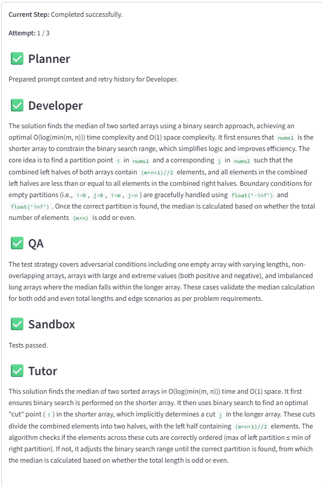
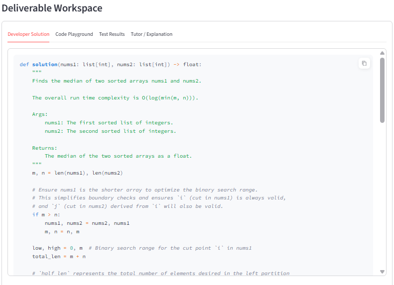
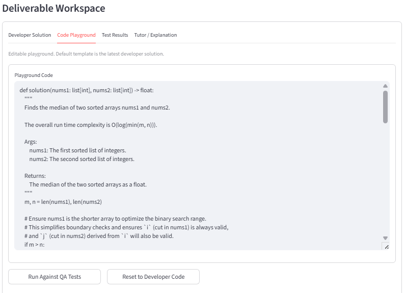
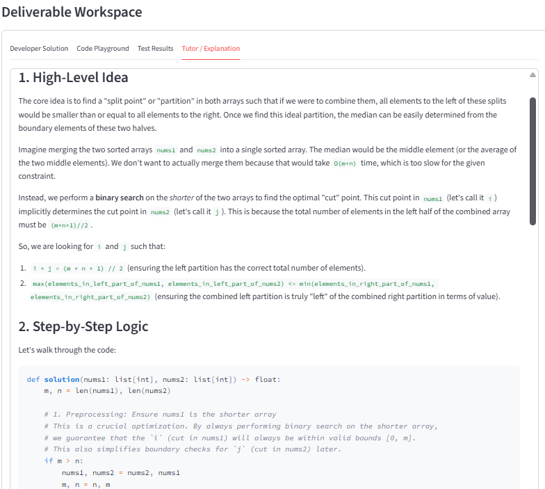

# Coding-as-a-Service

Multi-agent Coding-as-a-Service platform for algorithmic tutoring with execution-grounded validation.

This project orchestrates specialized AI agents to generate Python solutions, create adversarial tests, execute those tests in an isolated sandbox, retry failed attempts with structured reflection, and return a final explanation only after successful validation.

## Overview

Unlike single-pass code generation, this system uses a closed-loop pipeline:

1. Developer agent generates a candidate solution.
2. QA agent generates pytest tests.
3. Sandbox executes tests against the solution.
4. Reflection agent analyzes failures and guides retries.
5. Tutor agent explains the final working solution.

The architecture is split across:

- FastAPI API gateway (request/response + polling endpoints)
- Celery worker queue (long-running orchestration)
- Redis (job state + queue backend)
- CrewAI multi-agent cognitive pipeline
- Streamlit frontend (pure REST client)

## High Level Architecture


## Tech Stack

- Backend: FastAPI, Uvicorn
- Agent Orchestration: CrewAI
- Queue: Celery + Redis
- Frontend: Streamlit
- Sandbox: Python subprocess + pytest
- Evaluation: pass@k with API-driven runner

## Repository Structure

```text
backend/
  api/routes.py                # /solve, /status/{job_id}, /run-tests
  core/
    celery_app.py              # Celery + Redis configuration
    state_manager.py           # Redis-backed job state + in-memory fallback
    execution_sandbox.py       # Isolated code/test execution
  engine/
    agents.py                  # CrewAI agents (Developer, QA, Reflection, Tutor)
    orchestrator.py            # Step dispatcher
    pipeline_actions.py        # Pipeline transitions and retry logic
    prompts.py                 # Agent prompts and output contracts
    utils.py                   # Parsing/sanitization/logging helpers
  worker/tasks.py              # Celery task wrapper around pipeline

frontend/
  app.py                       # Streamlit workbench

evaluation/
  dataset.json                 # Task dataset
  run_eval.py                  # API-driven evaluation harness
  passk.py                     # pass@k estimator
  check_correctness.py         # Functional correctness check

tests/
  test_api_async.py
  test_complete_pipeline.py
  test_sandbox.py
```

## System Flow

The backend pipeline executes these steps:

1. `developer`
2. `sanitize_developer`
3. `qa`
4. `sanitize_qa`
5. `sandbox`
6. `reflection` (only on failure, with retry)
7. `tutor` (on success)
8. terminal state: `completed` or `failed`

Retry behavior:

- Maximum attempts: 3
- Each retry feeds prior code/errors into the next Developer prompt
- If retries are exhausted, job status becomes `FAILED`

## Prerequisites

- Python 3.10+ recommended
- Redis running locally or remotely
- Gemini API key for CrewAI model calls

## Installation

1. Clone the repository.
2. Create and activate a Python virtual environment.
3. Install dependencies:

```bash
pip install -r requirements.txt
```

4. Configure environment variables (copy from `env.example`):

```bash
PYTHONPATH=.
BASE_URL=http://127.0.0.1:8000/api/v1/tutor
GEMINI_API_KEY=your_gemini_api_key_here

REDIS_URL=redis://127.0.0.1:6379/0
CELERY_QUEUE=pipeline
CELERY_RESULT_EXPIRES_SECONDS=86400
CELERY_TASK_TIME_LIMIT_SECONDS=900
CELERY_TASK_SOFT_TIME_LIMIT_SECONDS=840
CELERY_TASK_RETRY_MAX_RETRIES=1
CELERY_TASK_RETRY_DELAY_SECONDS=5
JOB_STATE_TTL_SECONDS=86400
```

## Running the System

Start each component in a separate terminal from the project root.

### 1) Start Redis

Local Redis:

```bash
redis-server
```

Or Docker:

```bash
docker run --name caas-redis -p 6379:6379 -d redis:7
```

### 2) Start Celery Worker

```bash
python -m celery -A backend.worker.tasks worker --loglevel=info --pool=solo
```

### 3) Start FastAPI

```bash
python -m uvicorn backend.main:app --reload
```

API docs: http://127.0.0.1:8000/docs

### 4) Start Streamlit UI

```bash
streamlit run frontend/app.py
```

## API Endpoints

Base prefix: `/api/v1/tutor`

### POST `/solve`

Submit a new problem for asynchronous processing.

Request body:

```json
{
  "problem_description": "Reverse a linked list"
}
```

Response:

```json
{
  "job_id": "<uuid>",
  "status": "ACCEPTED"
}
```

### GET `/status/{job_id}`

Poll current job status and artifacts.

Example response (shape):

```json
{
  "status": "PROCESSING | COMPLETED | FAILED",
  "current_step": "Attempt 1: QA generating tests...",
  "code": "...",
  "explanation": "...",
  "artifacts": {
    "planner": {},
    "developer": {},
    "qa": {},
    "sandbox": {},
    "reflection": {},
    "tutor": {}
  },
  "current_attempt": 1,
  "max_retries": 3,
  "logs": []
}
```

### POST `/run-tests`

Execute arbitrary solution/test pair in isolated sandbox (used by UI playground).

Request body:

```json
{
  "solution_code": "def add(a,b): return a+b",
  "test_code": "from solution import add\n\ndef test_add():\n    assert add(1,2)==3",
  "timeout_seconds": 10
}
```

## Frontend Features

The Streamlit app provides:

- Requirement Anchor sidebar (dataset task or custom prompt)
- Orchestration stream (Planner -> Developer -> QA -> Sandbox -> Tutor)
- Developer Solution tab
- Code Playground tab with rerun against QA tests
- Test Results tab
- Tutor Explanation tab
- Event Ledger with backend logs

Predefined tasks are loaded from `evaluation/dataset.json`.

## Interface Overiview

### Pipeline Progress


### Code Solution


### Tests Result


### Code Playround


### Solution Explanation


## Testing

Run all tests:

```bash
pytest
```

Current tests cover:

- Sandbox behavior and timeout/error handling
- Async API submit + polling workflow
- End-to-end pipeline completion contract

## Evaluation (Pass@k)

Run API-driven evaluation:

```bash
python evaluation/run_eval.py --attempts 5 --k 1,3
```

Useful options:

- `--base-url` API base (default from `BASE_URL`)
- `--poll-timeout` max seconds per job poll cycle
- `--max-runtime` hard cap for full evaluation run
- `--max-tasks` subset of dataset (`0` means all)

Outputs are written to:

- `evaluation/results.json`
- `evaluation/summary.md`

Pass@k is computed with the unbiased estimator implemented in `evaluation/passk.py`.

## Operational Notes

- If Redis is unavailable, state manager falls back to in-memory storage.
- If Celery broker is unavailable, `/solve` will fail to enqueue and return `503`.
- Startup warnings in FastAPI indicate queue/state connectivity issues.

For a practical queue verification checklist, see `QUEUE_VERIFICATION.md`.

## Limitations

- Focused on algorithmic Python tasks
- QA tests are model-generated and may miss some edge cases
- Validation is test-based, not formal verification

## Author

Tan Liang Meng  
SC4052 Cloud Computing Course Project  
Nanyang Technological University